# Using R to Compare Annual Precipitation between Southern Coal Fields and Valley and Ridge Regions of West Virginia (2000-2010)

The objective of my final project is to compare annual precipitation amounts from 2000 to 2010 between the Southern Coal Fields region of West Virginia and the Valley and Ridge region. Landslides are more prevalent in the southern parts of West Virginia compared to the north and I want to see if differences in precipitation amounts are a factor. I will utlize R to implement exploratory data anaylses techniques to explore more about the data sets. These data are coming from 4 stations: BECKLEY RALEIGH CO AIRPORT, WV US GHCND:USW00003872, PRINCETON, WV US GHCND:USC00467207, GLADY 1 N, WV US GHCND:USC00463464, and KEYSER 2 SSW, WV US GHCND:USC00464840. These stations were from the Annual Observational Data Map from NOAA https://gis.ncdc.noaa.gov/maps/ncei/cdo/annual.

## Getting Started

Begin by cloning this repository to retrieve the csv files containing total annual precipitation amounts for 4 stations. Two are in the Valley and Ridge region and the other two are in the Southern Coal Fields region.

### Prerequisites

#### Packages
* library(ggplot2)

### Installing
install.packages("ggplot2")

### Read in the data using 'read.csv()'

```
Princeton <- read.csv(file="Princeton.csv")
Beckley_Raleigh <- read.csv(file="Beckley_Raleigh_Airport.csv")
Keyser <- read.csv(file="Keyser.csv")
Glady <- read.csv(file="Glady.csv")
```

## We will begin by producing boxplots for each of the datasets to learn more about the data.
```
Princeton_boxplot <- boxplot(Princeton$PRCP, main= "Princeton Annual Precipitation")
BeckleyRaleigh_boxplot <- boxplot(Beckley_Raleigh$PRCP, main= "Beckley_Raleigh Annual Precipitation")
Glady_boxplot <- boxplot(Glady$PRCP, main= "Glady Annual Precipitation")
Keyser_boxplot <- boxplot(Keyser$PRCP, main= "Keyser Annual Precipitation")
```
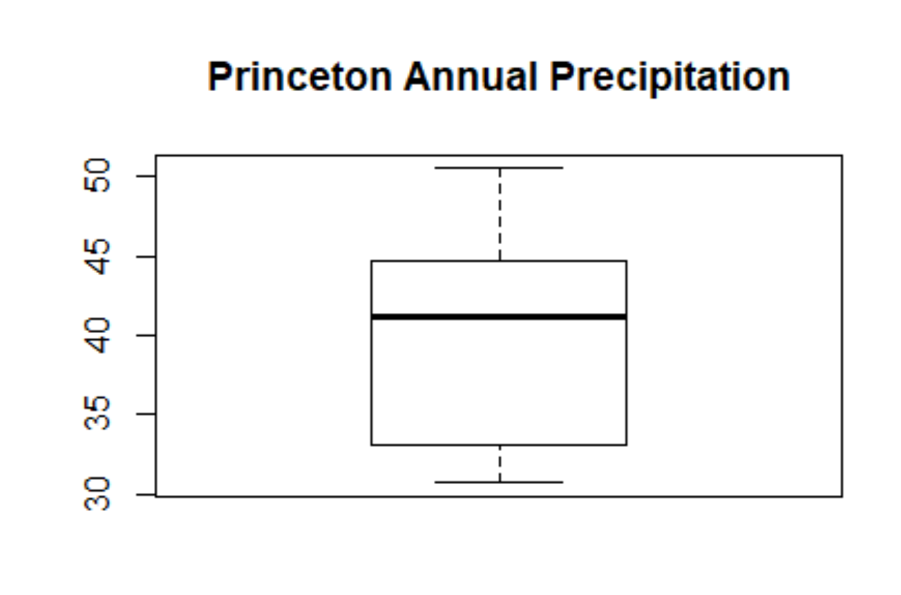 
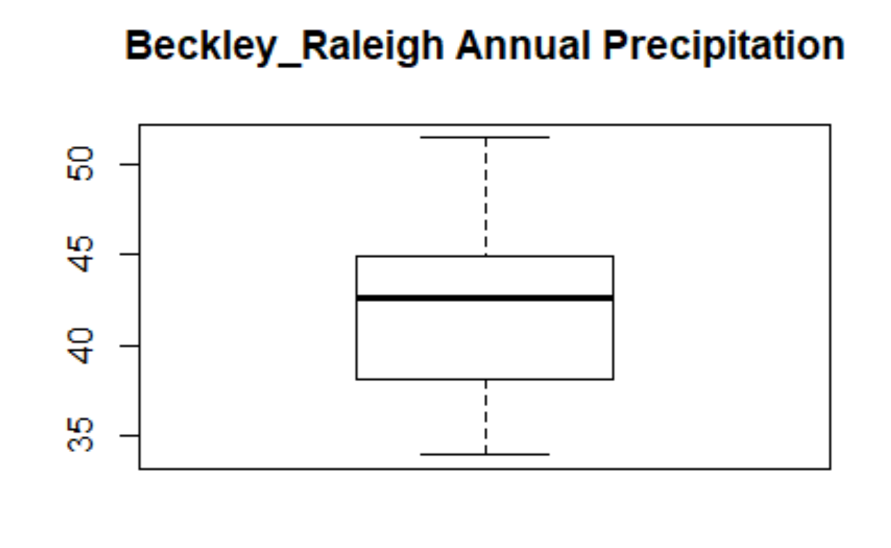
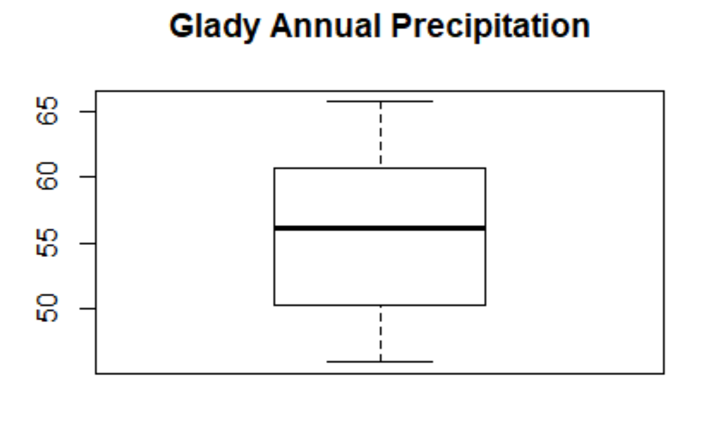
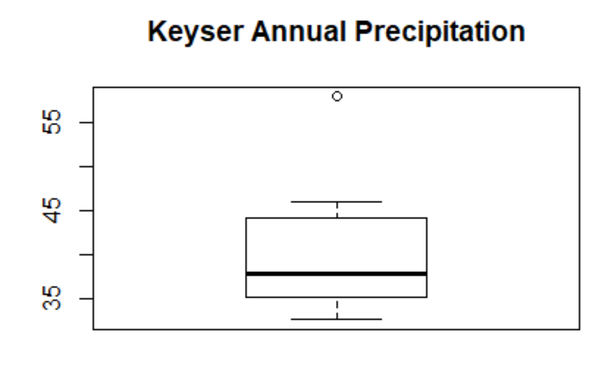
From these boxplots, we can see that Beckley Raleigh Airport and Keyser stations contained data that had a smaller variance. Princeton and Glady stations contained data that had a wider variance. We can also see that Keyser had one extreme outlier. The data from the Glady station appear to have generally higher values. 

## Next we can create some barplots to look at the frequency.
```
Barplot Script
Glady_Precip_bar <- barplot(Glady$DATE, main = "Glady Precipitation", xlab = "Total Annual Precipitation", col= "darkred")
Keyser_Precip_bar <- barplot(Keyser$PRCP, main = "Keyser Precipitation", xlab = "Total Annual Precipitation", col= "darkred")
Princeton_Precip_bar <- barplot(Princeton$PRCP, main = "Princeton Precipitation", xlab = "Total Annual Precipitation", col= "darkred")
BeckleyRaleigh_Precip_bar <- barplot(Beckley_Raleigh$PRCP, main = "Beckley_Raleigh Precipitation", xlab = "Total Annual Precipitation", col= "darkred")
```
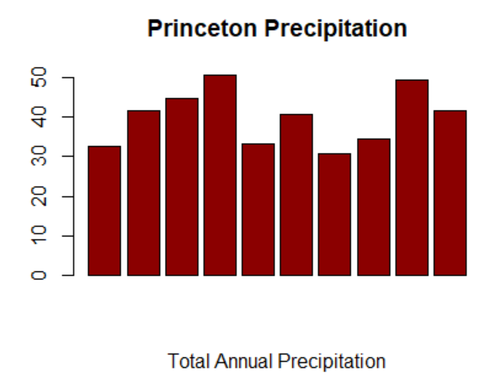
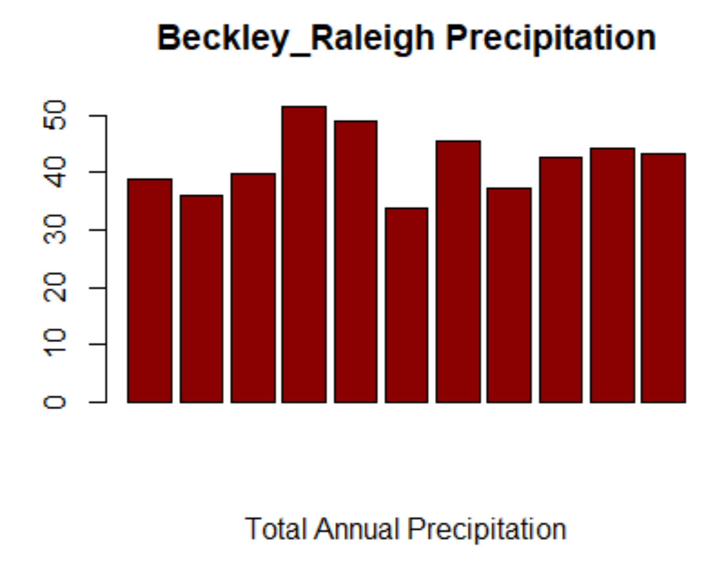
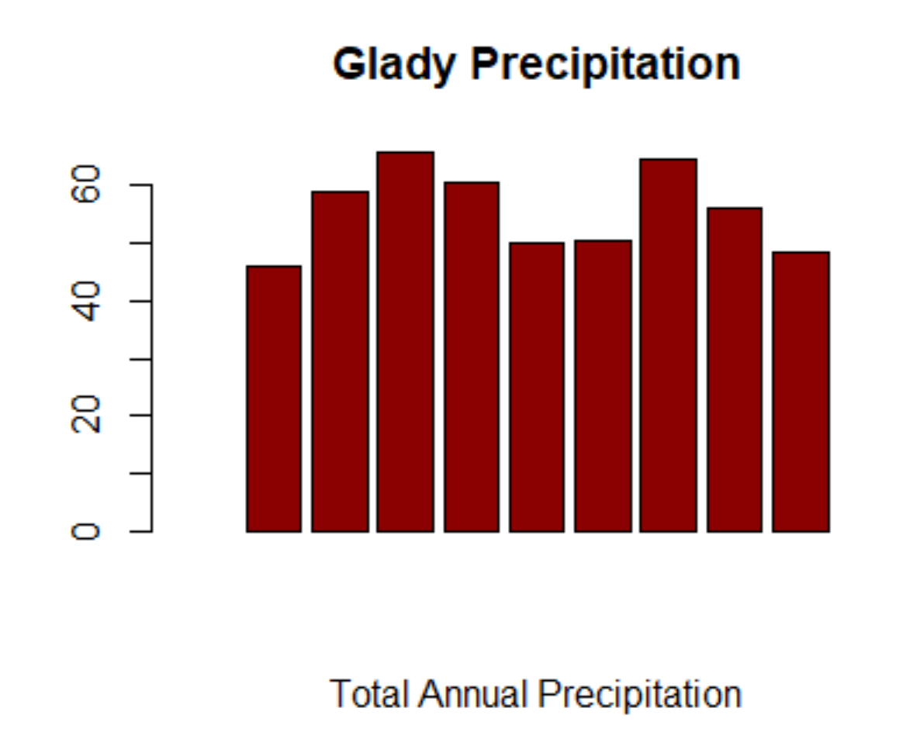
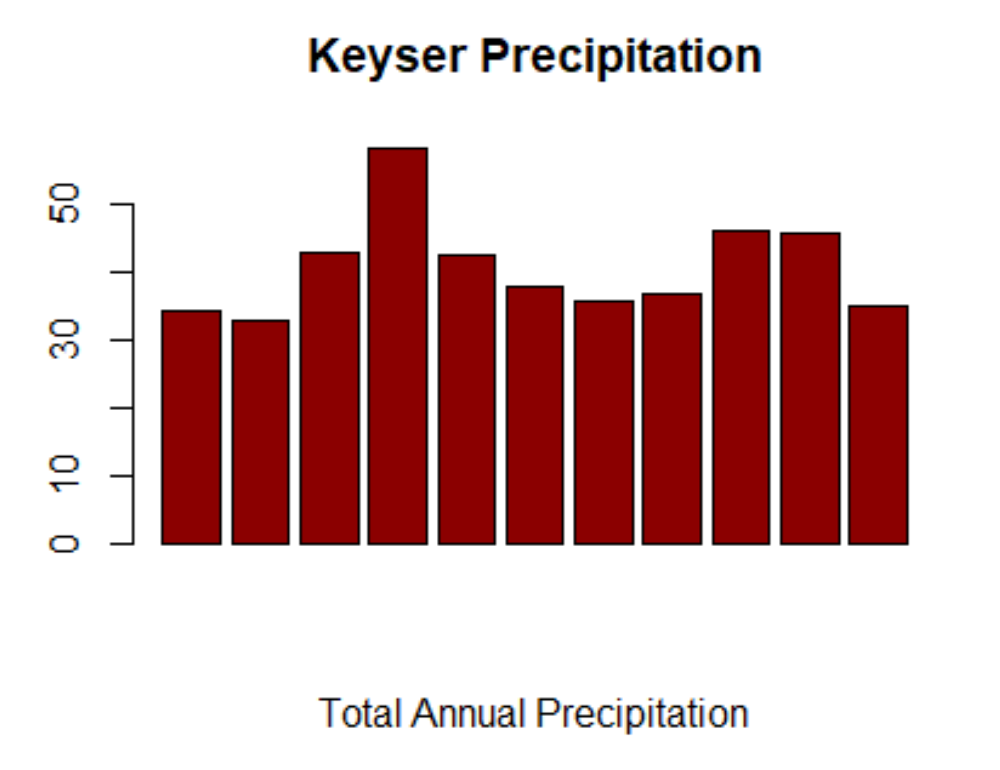
From these barplots we can see that the Beckley Raleigh Airport and Glady stations generally had values that were around 40 inches and above. The Keyser and Princeton graphs showed values from lower 30 to 50 inches. 

## Finally, we can plot the data to look at trends. 
```
Princeton_plot <- ggplot() + geom_line(aes(y = PRCP, x = DATE), data = Princeton)
BeckleyRaleigh_plot <- ggplot() + (aes(y = PRCP, x = DATE), data = Beckley_Raleigh)
Glady_plot <- ggplot() + geom_line(aes(y = PRCP, x = DATE), data = Glady)
Keyser_plot <- ggplot() + geom_line(aes(y = PRCP, x = DATE), data = Keyser)
```
### Princeton
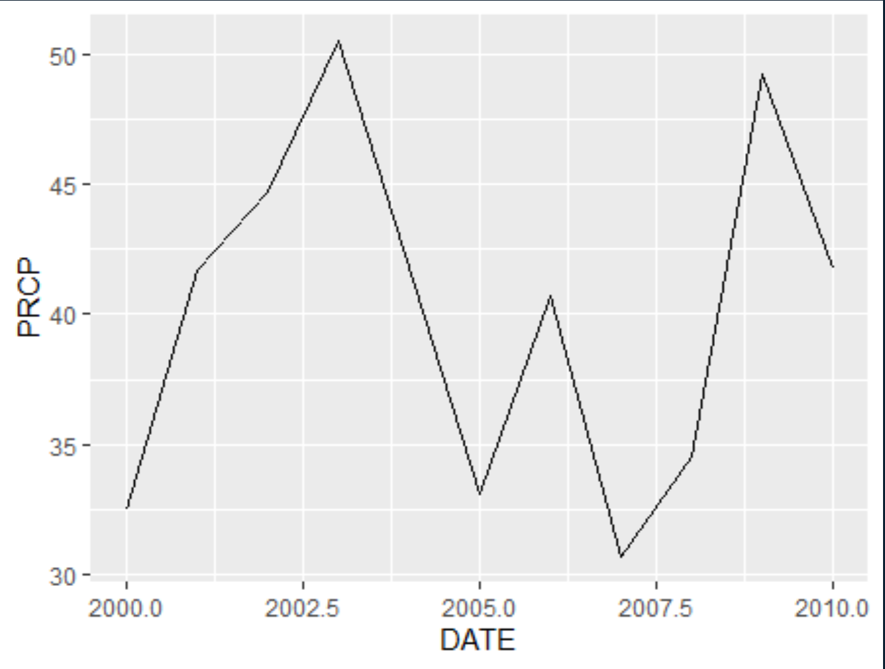
### Beckley_Raleigh
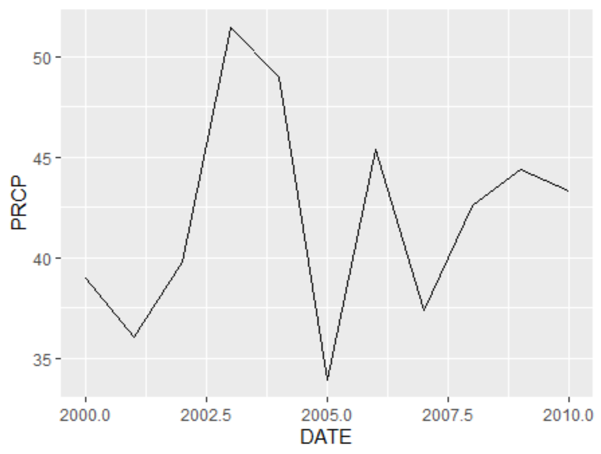
### Glady
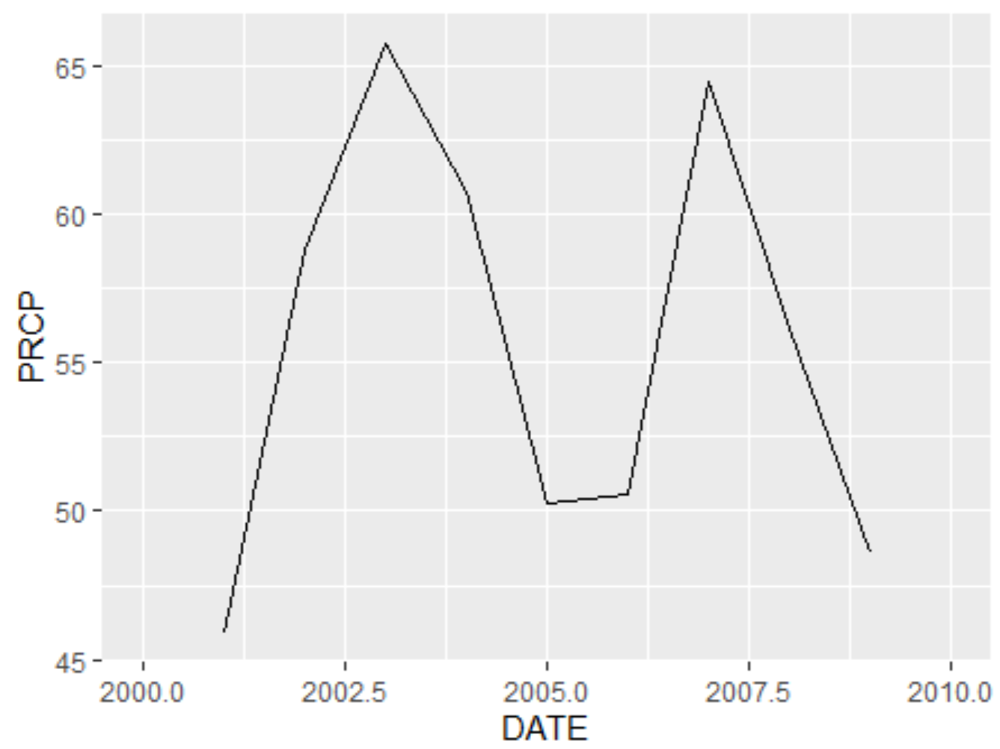
### Keyser
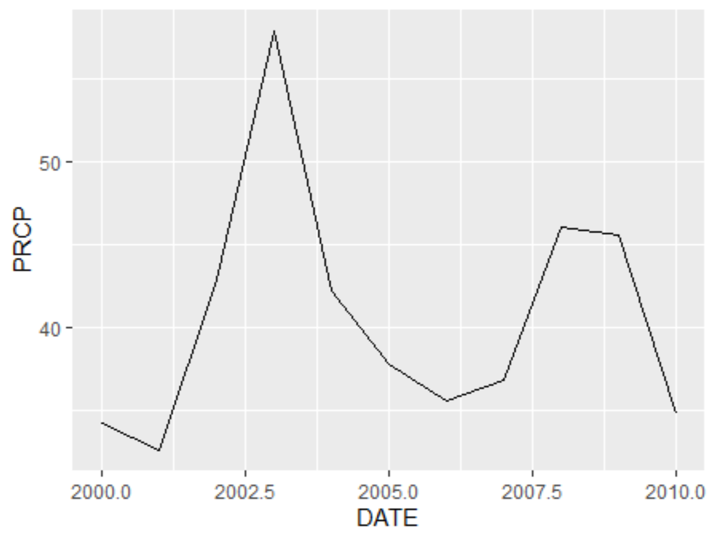

From these plots, we can see that Princeton and Beckley Raleigh share a generally similar trend of high peaks in 2003, 2006, and 2009. They also share low peaks in 2005 and 2007. This makes sense as both stations are in the Southern Coal Fields region. The Keyser and Glady plots share high peaks in 2003 and 2007 with low peaks around 2005 and 2010. This makes sense as both stations are in the Valley and Ridge region. 

## Authors

* **Billie Thompson** - *Initial work* - [PurpleBooth](https://github.com/PurpleBooth)

See also the list of [contributors](https://github.com/your/project/contributors) who participated in this project.


## Acknowledgments

* Hat tip to anyone whose code was used
* Inspiration
* etc
